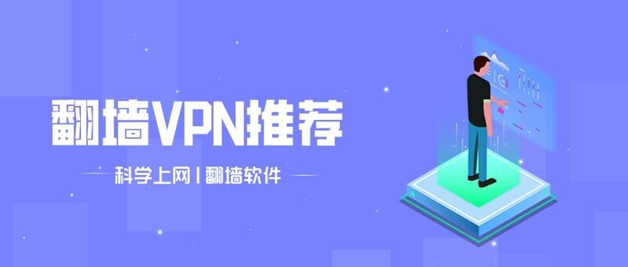
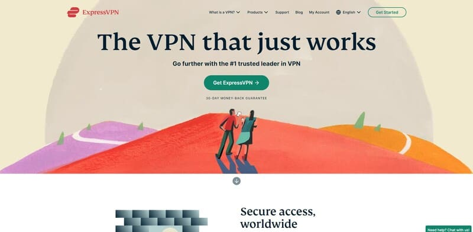
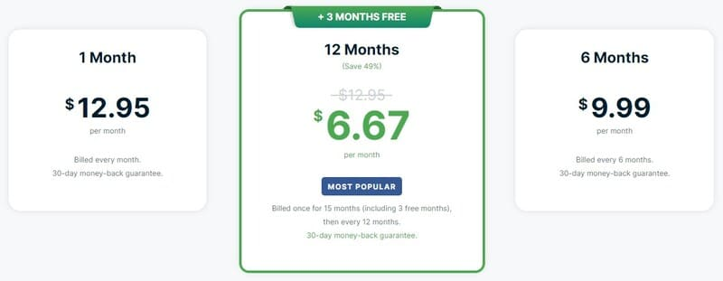
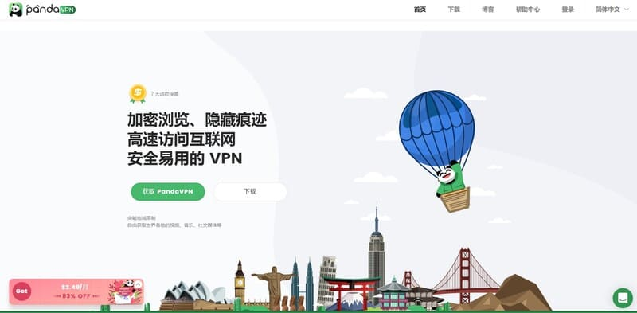
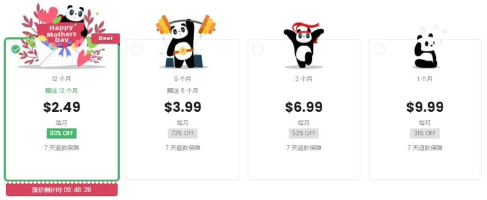
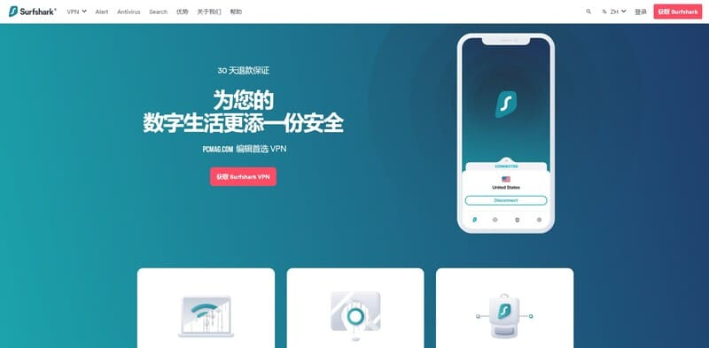
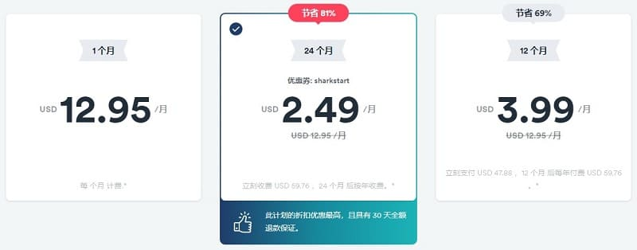
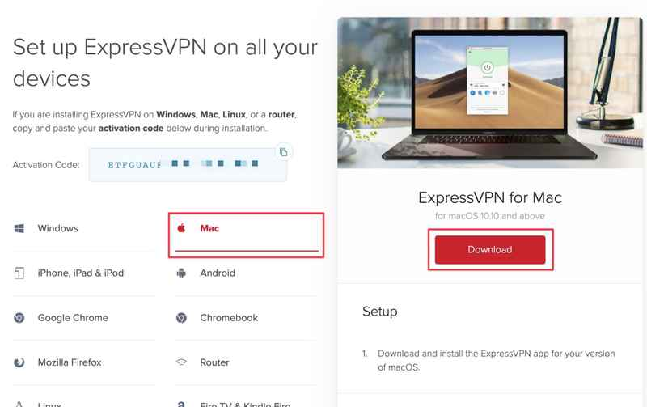
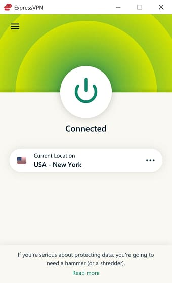

# 2022年5月最好用的中国VPN推荐，翻墙VPN软件排行

因为GFW的封杀，2022年还能在中国使用的VPN软件已经所剩无几了。为了寻找安全且好用的中国VPN，我们在大陆实测了上百款VPN软件，下面是我们基于VPN中国实测后给出的最佳VPN推荐，以及VPN排行。

如果你不想花费太多时间来阅读全文，而只想快速了解并选择一款好用的VPN，那么请查看我们下方的VPN中国简讯（如果你需要长期使用VPN来翻墙访问海外Google、Youtube、Netflix等网站，那么我们还是建议你花点时间来阅读全文）。

## VPN中国简讯 ：

### VPN中国首选：[ExpressVPN](https://qiangup.com/go/expressvpn) – 速度最快的中国VPN

>- 成立于2009年，总部位于英属维尔京群岛，至今已运营十多年了，是全球最顶级的VPN服务商。
>- 自主研发的LightWay协议可有效地绕过GFW的封锁和干扰，为中国网民提供稳定且快速的翻墙服务。
>- 采用银行级别的AES-256位加密技术和严格的零日志策略，在APP客户端中内置了终止开关、IP/DNS泄漏保护、广告拦截等高级功能。
>- 在全球94个国家部署了3000多台服务器，可解锁全球大部分受地域限制的网站和平台，包括Google、Facebook、Youtube、Netflix、BBC iPlayer等。
>- 完美地兼容所有主流的设备，包括Windows、MacOS、iOS、Android、Linux、智能电视、路由器、游戏机等，并允许五台设备同时登录使用。
>- 在中国周边地区（中国香港、中国台湾、日本、韩国、新加坡、美国等）部署了大量的高速服务器，可为国内VPN用户提供超快的连接。
>- 提供24/7在线客服，支持30天无理由退款等。

总得来说，ExpressVPN是一款非常值得推荐的VPN软件（安全、快速、简单易用），它也是我们VPN排行榜单的第一名。

### VPN中国（二）：[熊猫VPN](https://qiangup.com/go/pandavpn) – 为翻墙而生的中国VPN

>- 由一群身处塞舌尔的华人开发并运营的，为翻墙而生、主要客户群体是中国网民、最核心功能就是翻墙。
>- 采用自主研发的ECC协议，该协议不仅拥有传统代理协议（SSR和V2Ray）的翻墙能力和连接速度，而且还拥有传统VPN协议（OpenVPN）的隐私安全性。
>- 在全球的73个国家/地区部署了3000多台服务器节点，国内VPN用户不仅可以用它来快速访问Google、Facebook等海外网站，还可以流畅地观看Netflix、Hulu、Disney+、Amazon Prime Video等流媒体。
>- 兼容所有主流的设备，允许三台设备同时登录使用。
>- 直观的中文官网，中文版本的APP客户端、24/7的中文在线客服，对华人非常友好。

在我们整个VPN推荐列表中，熊猫VPN算是一个比较特殊的存在，价格也很便宜，速度快，非常适合中国网民使用，它是我们VPN排行榜的第二名。

### VPN中国（三）：[Surfshark](https://qiangup.com/go/surfshark) – 最经济实惠的中国VPN

>- 2018年在英属维尔京群岛成立，它虽然比较年轻，但却是近两年来最稳定、最好用的中国VPN之一，也是为数不多的仍能在中国稳定使用的VPN软件之一。
>- 在全球65个国家部署了3200多台高速服务器，完全能满足国内VPN用户日常访问海外网站的需求。
>- 为所有主流的设备都提供了简单易用的APP客户端，且支持无数台设备同时登录使用，整体性价比很高。
>- 价格便宜，也提供24/7在线客服和为期30天的退款保证。

总得来说，Surfshark也是一款值得尝试的VPN软件（尤其适合设备较多，或者想与多个朋友共享同一个付费帐号的用户），它是我们[VPN推荐](https://qiangwaikan.com/best-vpn-china/)榜的第三名。

### VPN中国（四）：[PureVPN](https://qiangup.com/go/purevpn) – 最老牌的中国VPN之一

>- 2006年在中国香港成立（算得上是最老牌的VPN软件之一），非常清楚中国网民的需求，也非常重视国内VPN用户。
>- 采用AES-256位加密技术和零日志策略，并在APP客户端中内置了多种高级功能，是一款安全且好用的VPN。
>- 为国内VPN用户提供了中文版本的官网，还为所有主流的设备都提供了简单易用的APP客户端，并支持10台设备同时登录使用。
>- 对于国内VPN用户来说，推荐的VPN节点是：中国香港、中国台湾、日本、韩国、新加坡、美国等，连接稳定，速度快，延迟低。
>- 价格便宜，提供24/7在线客服支持和为期31天的无理由退款保证。

PureVPN虽然在2021年的10月8日搬迁到了英属维尔京群岛，但经过我们的实测之后发现，PureVPN依然是最佳的中国VPN之一，而且还是我们VPN推荐榜的第四名。

#### 小提示：

1，因为GFW一直在不断的更新升级，所以世界上不可能有100%完美的翻墙软件。如果你的VPN软件遇到了无法使用（或者速度慢、连接不稳定）的情况，先尝试我们在下文“VPN中国不能用怎么办？”中提到的解决办法。如果你在尝试了各种办法之后，VPN依然无法正常使用，那么就直接联系在线客服，或者直接申请全额退款。（本文推荐的这几款VPN软件都提供24/7在线客服和为期30天的退款保证。）

2，我们“VPN推荐”榜单中的这些VPN都是全球顶级的品牌，知名度非常高。所以，市面上可能有一些假冒的品牌官网、假冒的APP客户端等。我们建议大家直接点击本文中的链接去访问它们的官网，然后从它们的官网上直接下载对应的APP客户端。

3，重要：不要从各大应用商店（Google play、Apple Store等）中直接购买VPN的付费套餐，否则你将无法享受各大品牌提供的优惠折扣，而且后续申请退款也非常麻烦。我们建议你点击本文中的链接去购买，可享受巨大的折扣优惠。

此外，我们还基于VPN中国实测之后，为大家挑选了几款适用于电脑、iPhobe/iPad、安卓等设备的VPN软件。

## 如何挑选中国VPN软件？

每个人使用VPN的目的都不一样，有的人是想访问Google查找资料，有的人是想观看Netflix上的美剧，有的人是想登录他的海外金融帐号。所以，一款真正值得被推荐的VPN必须具备以下几个条件（这也是我们在挑选最佳中国VPN和做VPN排行榜单时的标准）：

- **能在中国使用（即能翻墙）**

市面上虽然有几百款VPN产品，但能在中国使用且又好用的VPN却寥寥无几。因为GFW非常强大，而且它还在不断地更新升级，能在中国使用的VPN软件，必须拥有较高的伪装用户流量的能力，让GFW无法检测到用户正在使用VPN。此外，VPN服务商还必须非常重视中国市场，不仅需要开发针对GFW的专用VPN协议，而且一旦遇到部分VPN节点或者全部VPN节点被封的情况，就必须投入大量人力和物力去修复或者替换这些被封的VPN节点。事实上，拥有强大的实力且非常重视中国市场的VPN服务商非常少，这也是为什么能在中国使用的VPN寥寥无几的主要原因。总得来说，“能在中国使用”是我们“中国VPN推荐”最先要考虑的因素。

- **强大隐私安全保护**

很多国内VPN用户只关心能否翻墙，完全不在意这个VPN是否拥有强大的隐私安全保护功能，这是非常危险的。我们这里提到的隐私安全保护功能包括：军事级别的加密、严格的零日志策略、内置终止开关、恶意软件和广告拦截器、拆分隧道、IP/DNS泄漏保护等。优秀的VPN软件可以让你在互联网上始终保持匿名状态，而垃圾的VPN软件不仅无法提供安全保护，甚至还会收集并转售你的个人隐私和上网数据。

- **速度快**

无论你是想使用谷歌查找资料，还是想通过Facebook等社交媒体来开发维护客户，又或者是访问Netflix等流媒体平台来追剧，VPN的连接速度都至关重要。VPN连接速度的快慢，直接影响到你工作和学习的效率，也能影响你娱乐休闲的体验。这里的速度快是指，较大的上传和下载带宽和较低的延迟，确保你可以毫无压力地观看4K高清视频，可以快速加载海外的各种网页等。

- **性价比高**

高性价比是我们的终极追求。可能有些同学会问，为什么追求性价比，而不是追求便宜呢？你要清楚地明白一个道理，那就是一分钱一分货。在能翻墙、安全有保证、速度快、简单易用、售后有保证的前提下，我们当然希望价格越便宜越好。但是，好东西不便宜，便宜的VPN不一定是好东西。总得来说，一款安全且好用的VPN，每个月的费用平均在十几元或者二三十元的比较合理。

- **简单易用，支持多台设备登录**

90%以上的国内VPN用户都是技术小白，复杂的下载安装流程和繁琐的手动配置对技术小白来说就是噩梦。可能有些人会说，我不是技术小白，我也有兴趣去研究程序代码。但是你也别忘了，你寻找VPN的初衷是提高你工作和学习的效率，而非将自己变成为一个精通VPN的程序员。所以，我们在挑选最佳中国VPN时，会优先选择那些能完美地兼容所有主流设备和平台，下载安装简单，无需任何配置即可一键连接的VPN。此外，对于拥有多台设备、或者想跟朋友共享同一个付费帐号的人来说，“允许同时登录的设备数”也很重要，我们“VPN推荐”榜单中的VPN软件都允许5台，甚至10台设备同时登录。

- **遍布全球的VPN节点**

遍布全球的VPN节点可以有效地解决两个问题：解锁地域限制、提高连接速度。大部分的流媒体平台都会有地域限制，比如美国人无法观看Netflix英国区的视频，而英国人也无法观看Netflix美国区的视频。我们VPN排行榜中的这些VPN品牌，在全球所有主流的国家都拥有VPN节点，国内VPN用户可以通过切换VPN节点的方式来解锁全球大部分受地域限制的网站和平台。VPN排行榜中的这些VPN品牌，还在中国香港、中国台湾、日本、韩国、新加坡等地区部署了大量VPN节点，可以为中国VPN用户提供最快的速度和最低的延迟。

- **24/7在线客服**

我们在购买和使用VPN的过程中，难免会遇到一些或大或小的问题。如果VPN有24/7在线客服，那么当你遇到问题时，就可以在几分钟之内得到解决。如果VPN只有表单或者Email等支持方式，那么你一个非常简单的问题，可能也需要三五天才能解决。

- **至少30天的退款保证**

如果你是第一次购买VPN软件，或者第一次使用某个品牌的VPN产品，那么至少30天的退款保证就非常有必要了。在VPN的退款保证期内，你可以尽情地测试它，一旦发现它不好用，或者无法满足你的需求，那么你可以随时申请全额退款，不会有任何资金风险。反之，一个没有退款保证期的VPN软件，一旦你购买了，即便是它完全无法在中国使用，那么你的钱也只能打水漂。

## 最好用的中国VPN推荐

一款优秀的中国VPN软件，必须能稳定地翻墙，有强大的隐私安全保护功能，稳定且快速的连接，能解锁大部分受地域限制的网站，完美兼容所有主流的设备和平台，简单易用的APP客户端，较高的性价比，提供24/7在线客服和至少30天的退款保证。下面是我们基于VPN中国实测后给出的最佳VPN推荐，以及VPN排行：

### **VPN中国首选：[ExpressVPN](https://qiangup.com/go/expressvpn) – 速度最快的中国VPN**

ExpressVPN成立于2007年，至今已稳定地运营了十五年，算得上是最老牌的VPN软件之一，在业内拥有良好的信誉和口碑。ExpressVPN自主研发的Lightway协议翻墙效果非常好，不仅连接稳定，而且速度很快。因此，ExpressVPN是我们VPN推荐榜的第一名。接下来我们将从多个方面对ExpressVPN进行评估：

**翻墙能力**：市面上虽然有上千款VPN软件，但它们大多采用的是OpenVPN、IKEv2/IPSec、IPSec等传统协议，而传统的VPN协议根本无法绕过GFW的封锁，这也是大多数VPN软件无法在中国使用的原因。ExpressVPN之所以能在中国稳定地使用，这完全要归功于它自主研发的Lightway协议，它在传统VPN协议的基础上增加了流量混淆功能，可以有效地绕过GFW的检测和封锁，从而可以为中国VPN用户提供稳定的翻墙服务。

**隐私安全性**：ExpressVPN的总部位于英属维尔京群岛，该地区远离5眼/7眼/14眼联盟的监控范围，且没有数据保留法，整个大环境对ExpressVPN非常的有利。而且ExpressVPN采用了高级的AES-256位加密技术、严格的零日志策略、完全私有化的DNS服务器等，可以真正做到隐藏用户的真实IP地址，让用户在互联网上始终保持匿名的状态。ExpressVPN还在它所有的APP客户端中内置了终止开关、拆分隧道、IP/DNS泄漏保护、广告拦截等高级功能，可以最大程度地保护中国VPN用户的隐私安全。

>**解锁能力**：众所周知，VPN软件解锁地域限制的能力主要取决于两个方面：在多少个国家部署了VPN节点、VPN节点的数量和质量（包括备用的VPN节点）。ExpressVPN在全球94个国家/地区部署了3000多个VPN节点，其中大部分VPN节点位于北美、欧洲和中国周边，而在南美洲、非洲、中东等地区也拥有一定数量的VPN节点。也就是说，ExpressVPN可以解锁全世界大部分受版权和地域限制的网站和服务，包括美剧爱好者们经常访问的Netflix、Hulu、HBO、Disney+、BBC iPlayer、YouTube等流媒体平台，以及中国VPN用户经常访问的Google、Twitter、Facebook、Gmail、WhatsAPP等网站。

**连接速度**：VPN软件连接速度的快慢跟VPN节点的物理距离有很大的关系，理论上来说，VPN节点离用户越近，连接速度越快。ExpressVPN在中国周边地区（包括中国香港、中国台湾、日本、韩国、新加坡等）部署了大量的服务器节点，而且没有任何的流量和带宽限制。经过我们多次实测后发现，ExpressVPN的速度是业内最快的，观看高清视频非常的流畅、玩游戏延迟也很低。

**兼容性**：ExpressVPN可以完美地支持几十种常见的设备和平台，包括Windows、MacOS、Linux等电脑；Android、iOS等手机和平板电脑；路由器、智能电视、游戏机等设备；Chrome、Firefox、Safari等浏览器。ExpressVPN为所有主流的设备都提供了专用的APP客户端，即使是技术小白也可以快速地下载安装并一键翻墙出国。

**价格**：ExpressVPN提供三种付费套餐，其中12个月套餐的性价比最高，每月仅需6.67美金。现在点击下方链接购买，还额外免费赠送3个月。

**客户支持和退款政策**：ExpressVPN提供24/7在线客服、Email、表单等多种客户支持方式，它们的所有付费套餐都支持30天的退款保证。

**ExpressVPN小提示**：

>- 1.中国VPN用户最好选择中国台湾、香港、日本、韩国、新加坡、美国等地区的服务器节点，这些地区的VPN节点连接速度最快，延迟最低。
>- 2.与其他VPN软件相比，ExpressVPN的价格略微贵一点点，但它绝对物有所值。每个月只需多出一两美金，你就可以享受到业内最稳定的翻墙、最快的连接速度。
>- 3.ExpressVPN提供为期30天的退款保证，如果你购买之后发现它不好用，或者说达不到你的预期，那么你随时可以申请全额退款，不会有任何资金风险。

#### ExpressVPN无法连接怎么办？

因为GFW每年都会升级几百上千次，任何一款VPN软件都不可能做到全年的连接成功率为100%。当你在使用ExpressVPN的过程中，出现了偶尔无法连接的情况，请尝试以下方法：

>- 1.尝试多更换几个VPN节点，优先选择中国台湾、香港、日本、韩国、新加坡和美国地区的VPN节点。
>- 2.重启ExpressVPN客户端，或者重启你的设备。
>- 3.尝试切换ExpressVPN提供的其他VPN协议。
>- 4.查看消息中心是否有软件升级等相关公告，或者重新下载安装ExpressVPN客户端。
>- 5.联系ExpressVPN的24/7在线客服寻求帮助。

一般来说，无论什么原因导致的无法连接，在线客服都会在最短的时间内给你最有效的解决方案。如果ExpressVPN的在线客服也解决不了，那么就果断的申请全额退款吧。

### VPN中国（二）：[熊猫VPN](https://qiangup.com/go/pandavpn) – 为翻墙而生的中国VPN

在我们的VPN推荐榜中，熊猫VPN是一个比较特殊的存在。熊猫VPN的总部虽然在塞舌尔，但它却是由一群华人开发并运营的，它最主要的客户群体是中国网民，它最核心的功能就是翻墙。熊猫VPN还为中国VPN用户提供了专用的中文官网、中文APP客户端、中文帮助文档、中文在线客服。总得来说，熊猫VN是一款非常好用的VPN，它使用简单，翻墙稳定且速度快，非常适合华人新手使用。

**翻墙能力**：熊猫VPN可以说是为翻墙而生的，它采用的是自主研发的ECC协议，该协议完美地结合了SSR协议的翻墙能力和OpenVPN协议的安全性。也就是说，熊猫VPN不仅可以稳定地翻墙，而且速度非常快，安全也不差。

**解锁能力**：熊猫VPN在全球的73个国家部署了3000多台服务器，包括美国、加拿大、墨西哥、英国、法国、德国、澳大利亚、日本、新加坡、韩国等。所以，熊猫VPN可以轻松解锁Netflix、HBO、Disney+、Hulu、BBC iPlayer、Nicovideo、AbemaTV、LovaIsLand、TVer、ITV、DMM、France TV等流媒体。除此之外，中国VPN用户还可以借助熊猫VPN快速访问Google、Youtube、Facebook等网站。

>**连接速度**：熊猫VPN的连接速度几乎可以与ExpressVPN相媲美，VPN中国用户可以非常流畅地播放1080P高清视频。首先，熊猫VPN采用的是自主研发的ECC协议，该协议继承了SSR和V2Ray等协议超快的翻墙速度。其次，熊猫VPN在台湾、香港、日本、韩国、新加坡等中国周边地区部署了大量的VPN节点，对中国VPN用户而言，VPN节点的物理距离越近，连接速度越快。最后，熊猫VPN没有任何流量和带宽限制，它甚至还提供了用于观看流媒体、玩游戏、P2P下载种子的专用VPN节点。此外，为了防止VPN节点被封，熊猫VPN还储备了大量的备用VPN节点。

**兼容性**：在兼容性上，熊猫VPN的优势不大，但也还是为Windows、Android、Mac、iOS、Linux等设备提供了专用的APP客户端。熊猫VPN的所有客户端都有中文版本，而且界面设计的也很有特色，下载安装和使用都非常简单。不过比较遗憾的是，熊猫VPN的一个付费帐号只能在三台设备上同时登录使用。

**价格**：近两年来，随着熊猫VPN的品牌知名度越来越高，它的价格也在水涨船高，从最开始的1.99美金/月逐渐涨到了现在的2.49美金/月。与其他VPN软件下，熊猫VPN的价格还是有一定竞争力的，而且熊猫VPN价格的不断上涨也侧面说明了它确实越来越好用了。

熊猫VPN价格：2.49美金/月

**客户支持和退款政策**：熊猫VPN提供24/7（中文）在线客服，你还可以加入它们的Telegram会员群组与其他用户交流使用心得。关于退款政策，熊猫VPN只提供为期7天的退款保证。所以，当你购买了熊猫VPN付费帐号之后，需要尽快地评估测试它，如果不满意，你可以在7天之内申请退款。

#### 熊猫VPN安全吗？

有些VPN推荐博客说熊猫VPN不安全，但事实真的如此吗？

>- 1.严格地来说，熊猫VPN在隐私安全保护方面，确实不如ExpressVPN。但是，熊猫VPN自主研发的ECC加密技术也可以完全隐藏用户的真实IP地址，并给用户提供足够的隐私安全保护。如果你使用熊猫VPN的目的是为了正常的工作、学习和娱乐，那么它的隐私安全性足够了。如果你对隐私安全的要求极高，那么我们推荐你选择：ExpressVPN。

>- 2.熊猫VPN的总部位于塞舌尔，该地区远离5眼/7眼/14眼联盟的监视，也没有数据保留法，任何组织和个人都无权要求熊猫VPN交出用户的上网数据。而且当你在注册熊猫VPN帐号的时候，你甚至可以不用邮箱，系统会为你自动生成一个数字账户，你也可以使用比特币购买。

>- 3.熊猫VPN的总部在海外，它不属于国内VPN服务商，所以也不会有被请喝茶的可能。

>- 4.熊猫VPN至今已稳定地运营了五年多了，而且在全球拥有庞大的客户群体，在业内的声誉和口碑也很好。所以熊猫VPN也不存在跑路的风险。

总得来说，熊猫VPN虽然属于机场一类的翻墙软件，但它却能够给中国VPN用户提供足够的隐私安全保护，而且它翻墙稳定、连接速度快，价格便宜、简单易于使用、拥有良好的客户支持等。所以，熊猫VPN算的上是一款非常好用的VPN，也是一款非常值得推荐的VPN软件。

### VPN中国（三）：[Surfshark](https://qiangup.com/surfshark-review/) – 最经济实惠的中国VPN

Surfshark成立于2018年，公司总部位于英属维尔京群岛，也是一款比较好用的VPN软件。首先，Surfshark采用独特的NoBorders模式，可轻松地绕过GFW的检测和封锁，能为中国VPN用户提供稳定的翻墙服务。其次，Surfshark在隐私安全、解锁能力、兼容性和易用性等方面都表现良好。最后，Surfshark价格便宜，支持30天退款保证，而且还允许无数台设备同时登录使用，性价比非常高。

**翻墙能力**：VPN软件的翻墙能力对中国VPN用户来说非常重要，而Surfshark独有的NoBorders模式可以很好地混淆和伪装用户的流量，从而实现科学上网的目的。

**安全性**：Surfshark采用的是业内最先进的AES-256位加密技术、严格的零日志策略、专用的DNS和多种内置的高级功能，能彻底隐藏用户的真实IP地址，让用户在互联网上始终保持匿名状态，用户的上网数据也不可能被任何人所破解。值得一提的是，Surfshark还通过了第三方安全机构的权威认证。

**解锁能力**：Surfshark在全球的65个国家部署了3200多台服务器，包括北美洲、南美洲、欧洲、非洲、中东、亚洲、大洋洲等。中国VPN用户可借助Surfshark遍布全世界的VPN节点去解锁Netflix、HBO、BBC iPlayer、Hulu、Disney+、YouTube、Facebook、Reddit、Twitter、Instagram等网站。Surfshark也没有任何带宽和流量限制，国内VPN用户可尽情地观看流媒体视频节目。

**兼容性**：Surfshark目前除了不支持路由器之外，其他主流的设备都可以支持，包括Windows、Android、MacOS、iOS、Linux、智能电视、游戏机等设备，以及Chrome、Firefox、Safari等浏览器。

**价格**：Surfshark的价格在业内算是比较便宜的，每月仅需2.30美金，而且每年的重要节假日还有大优惠折扣。Surfshark支持的付款方式有PayPal、信用卡、支付宝、Google Pay、Amazon Pay和加密货币。

**客户支持和退款政策**：与ExpressVPN一样，Surfshark也提供24/7在线客户支持和为期30天的退款保证。你也可以通过Email和表单等形式与客户团队取得联系。

**重点**：Surfshark是不限制登录设备数的，也就是说你可以在十几台、甚至几十台设备上登录同一个付费帐号。换句话说，你可以与几十个朋友共享同一个付费帐号。Surfshark是我们整个VPN排行榜中性价比最高的一个。

#### Surfshark VPN中国使用小提示：

有些网友反馈说Surfshark会出现偶尔无法翻墙的情况，那么我们在这里也给大家强调一下：如果你身处中国，在你使用Surfshark之前，确保将高级设置中的NoBorders功能打开，该功能可以混淆和伪装用户流量，从而大大提升翻墙的稳定性。当然，你也可以通过24/7在线客服找技术人员帮你解决。

## 如何使用中国VPN？

以下是在中国使用ExpressVPN的步骤：

#### 1.点击我们的[ExpressVPN优惠链接](https://qiangup.com/go/expressvpn)，进入VPN官网。

#### 2.选择你需要的套餐时长，购买包年套餐可享买一年送一年优惠。

#### 3.从ExpressVPN后台下载适用于你设备的APP客户端，常用的设备包括：Windows、MacOS、iOS、Android等。

#### 4.打开APP客户端，登录付费账号密码，然后点击一键连接，开始自由地访问海外互联网。

如果没有特殊需求，我们建议你直接选择中国周边地区的VPN节点。

## 为什么要使用中国VPN？

虽然说VPN软件最主要/最核心的功能是加密和保护个人隐私，但在中国网民眼中VPN≈翻墙工具。对于身处中国的网民来说，他们使用VPN的主要目的是翻墙出国，访问被GFW屏蔽的Google、Facebook、Youtube等网站，以及受地域限制的Netflix、HBO、Hulu等流媒体平台。对于身处海外的华人来说，他们使用VPN的主要目的是翻墙回国，访问国内腾讯视频、爱奇艺、优酷视频、网易云音乐、QQ音乐等网站和平台。除此之外，VPN还会顺带被用于保护个人隐私。

### 翻墙出国

正如我们在“[科学上网](https://qiangup.com/gfw/)”一文中提到的，因为GFW的存在，中国网民无法自由访问海外的一些网站和平台，包括Google、Facebook、Twitter、Instagram、Gmail、WhatsApp、Skype、Wikipedia等。但是，我们可以通过VPN软件位于海外的VPN节点，并获取一个海外的IP地址，然后以海外人士的身份自由地访问这些被GFW封杀的网站。

除此之外，世界上还有很多受地域限制的内容和服务，包括Netflix、Hulu、HBO、BBC iPlayer等流媒体。有了VPN之后，我们就可以自由地切换VPN节点，然后尽情地享受当地所以的流媒体服务了。比如，你虽然身处中国，但你却想看Netflix美国区的电影，那么你就可以选择美国的VPN节点，然后就可以观看美区Netflix啦。你也可以选择英国的VPN节点，然后你就可以随时观看英国区Netflix内容。

### 翻墙回国

正如我们在“回国VPN”中提到的，因为版权和地域限制等问题，国内的很多网站和平台也只允许大陆IP去访问。但对于身处海外的华人来说，他们还是更习惯看国内的华语电视，更喜欢听国内华语音乐。有了VPN软件之后，身处海外的华人就可以轻松地获取到一个国内的IP地址，然后就可以自由地访问国内所有的网站和APP啦，比如腾讯视频、爱奇艺、优酷视频、芒果TV、网易云音乐、酷狗音乐、QQ音乐、抖音、BiliBili等等。

### 加密

对于大部分中国网民来说，VPN仅仅是一个科学上网工具，只要能用来翻墙就行，但VPN软件最核心的功能却是机密。VPN可以让我们在互联网上始终保持匿名状态，并对我们的上网数据进行加密处理，而且VPN还通过内置大量高级功能（终止开关、拆分隧道、IP/DNS泄漏保护、广告/恶意软件拦截等）来最大化地保护用户的个人数据安全。有了VPN的保护，无论你使用的是公司WIFI，还是ISP的数据网络，亦或者是咖啡馆和机场的共享WIFI，任何组织和个人都无法知道你是谁，也不知道你在互联网上干了什么，更不可能窃取你的银行等金融帐号密码。

小结：在互联网安全问题日益突出的今天，VPN已成为我们工作和生活的必需品了，它不仅可以用来翻墙，也可以有效地保护我们个人隐私和上网数据安全。

## VPN中国使用须知

如果你是第一次了解VPN，或者你的工作和生活高度依赖VPN，那么我们建议你看看下面的VPN中国使用须知：

### 提前下载好VPN客户端

如果你计划回中国，或者计划去中国旅行，那么最好提前多下载几个VPN客户端，尤其是iPhone、iPad、Android等设备。

首先，因为GFW屏蔽了绝大多数的VPN品牌官网，身处中国的网民是无法自由访问各大VPN品牌官网的，所以你也就无法从VPN品牌官网上直接下载VPN客户端。

其次，因为某些原因，Apple Store中国区下架了所有的VPN软件，你在中国也无法打开Google Play等应用商店，所以从各大移动应用商店中下载VPN客户端也比较艰难。

总得来说，我们建议你在进入中国之前，最好多下载几个VPN客户端备用。

### 多准备几款VPN软件

正如我们在前文提到的，因为GFW的存在，世界上不可能有100%完美的VPN，每一款VPN都或多或少会出现一些无法使用的情况。唯一的区别是，牛逼的VPN服务商会在最短的时间内解决问题，实力较弱的VPN服务商可能会一蹶不振。所以，如果你的工作和生活高度依赖VPN，那么最少要准备2个以上的VPN。当第一个VPN软件出现无法使用的情况时，还有另外一个VPN软件可以使用。

### 优先选择中国周边地区的VPN节点

理论上来讲，VPN节点的物理距离越近，连接越稳定，速度也越快。我们VPN推荐榜单中的那些VPN品牌，虽然在全球所有主流国家都部署了VPN节点，但对于身处中国的网民来说，并不是所有的VPN节点都适合你。我们建议你优先选择中国台湾、中国香港、日本、韩国、新加坡等中国周边地区的VPN节点。你也可以选择美国的VPN节点，毕竟美国是世界互联网的中心，不仅拥有大量的VPN节点，而且连接速度也不错。如果不是特殊需求，我们不建议你选择欧洲、非洲等地区的VPN节点，因为这些地区的VPN节点连接速度基本上都比较慢，延迟也很高。

### 选择针对GFW的专用VPN协议

为了应对GFW的封锁，顶级的VPN服务商都会开发一套针对GFW的专用VPN协议，比如ExpressVPN的LightWay协议，熊猫VPN的ECC协议等。传统的OpenVPN、IKEv2/IPSec、PPTP等协议基本上都无法绕过GFW的检测和封锁。所以，如果你身处国内，那么我们建议你优先选择针对GFW的专用VPN协议（如果你不知道如何选择，可以联系在线客服）。

### 充分利用VPN软件的退款保证期

如果你是第一次使用某个VPN，或者只是短期之内需要使用一下VPN，那么我们建议你充分利用好VPN的退款保证期。比如，你计划去中国旅游半个月，那么你在进入中国之前开通VPN付费帐号，当你旅游结束离开中国时，再申请全额退款。这样的话，你不用花费一分钱，就可以免费试用15天。如果你是第一次使用某款VPN，你也可以利用退款保质期来充分测试它，满意就继续使用，不满意随时申请退款。我们VPN排行榜单中的这些VPN品牌，都拥有30天的退款保质期，你可以放心地尝试。

### 不建议使用免费VPN软件（细节见下文）

免费VPN虽然非常有吸引力，但我们不建议你尝试免费VPN。首先，免费VPN根本无法在中国使用。其次，免费VPN存在诸多风险。如果你实在没有什么预算，那么请查看：[免费VPN](https://qiangup.com/free-vpn/)。

## 使用中国VPN软件注意事项

在中国使用VPN，尽量注意以下三个事项，尤其是第二项和第三项：

### 不要浪费时间去尝试那些已经被GFW封杀的VPN软件

市面上虽然有很多的VPN品牌，但并不是每款VPN都能在中国使用。毫不夸张的说，全球95%以上的VPN都无法在中国使用。注意，不是偶尔不能用，也不是不好用，而是根本无法使用。国外有很多知名度很高，用户口碑也非常好的VPN品牌，它们在海外非常的好用，但就是无法绕过GFW的封锁。对于中国网民来说，一款无法翻墙的VPN，它就是一坨翔，你同意吗？所以，不要再浪费时间去尝试那些根本无法在中国使用的VPN软件了。

哪些VPN软件无法在中国使用呢？详情请见下方：不推荐使用的VPN软件。

### 切勿使用国产VPN软件

从2017年开始，因为政策的原因，大量的VPN中国服务商不得不关门歇业，包括GreenVPN在内的一批知名的服务商都被迫停止服务了。现如今，能在中国使用的VPN软件，大部分都是海外的服务商。当然，国内也有一些个人或者小团队采用SSR和V2Ray等协议来搭建翻墙梯子和机场VPN，然后再进行售卖。但这些翻墙软件都是见不得光的，一旦被发现，运营者随时都有可能被请去喝茶。除了被请喝茶之外，这些小的运营商也随时有卷钱跑路的风险。也就是说，国产的VPN软件随时都有可能让你人财两空。此外，国产的VPN软件根本没有安全可言，它们不仅无法保护你的个人隐私，一旦运营者被请喝茶，你的所有个人资料和上网日志都会被相关部门看到。最后，国产VPN软件的运营者为了安全考虑，它们大多只会提供在线表单这一个客户支持方式，当你遇到问题想要找客服时，可能十天半个月都得不到回复。

谨记，切勿选择国产VPN软件。优先选择我们VPN排行榜单中的这些海外顶级VPN品牌。

### 禁止浏览/传播黄赌毒和敏感信息

本文推荐的中国VPN仅用于正常的工作和学习，切勿使用VPN来浏览和传播黄赌毒相关的信息，也不要浏览和传播与政治、经济、文化、宗教等相关的信息。

## 我可以使用免费的中国VPN软件吗？

不要再浪费时间去寻找和尝试那些免费的中国VPN软件了。原因有三：

首先，我们可以很肯定地告诉你，能在中国使用，且完全免费的VPN根本不存在。现如今，能在中国使用的付费VPN都寥寥无几，更不要说免费VPN了。为了与GFW抗衡，以ExpressVPN为首的几个顶级的VPN服务商每年都会投入大量的人力和财力。即便如此，在每年的特殊时期，ExpressVPN也偶尔会出现短暂无法连接的情况。而完全免费的VPN拿什么跟GFW相抗衡呢？

其次，免费中国VPN一点也不安全。因为那些所谓的免费中国VPN宣称的是免费，所以它们不会收取用户的订阅费，但是它又需要赚钱（难道做慈善？），所以它们就会想办法从其他渠道来盈利。比如，有良心一点的服务商，会通过营销/诱导手段来迫使用户升级成为它们的付费会员；良心不那么黑的服务商，会在APP客户端中内置大量的弹窗广告，通过强迫用户观看广告来盈利；良心黑一点的服务商呢，会收集你的个人信息或者上网数据，然后转售给第三方来盈利；完全没良心的服务商呢，就会开发一个钓鱼软件，或者在VPN软件中内置木马病毒，然后打着免费中国VPN的旗号，诱骗小白来下载安装。如果你运气好，碰到有一点良心的服务商，最坏的结果就是无法使用，浪费一点时间。如果你遇到完全没良心的服务商，那后果就不堪设想了。

以下几个免费VPN虽然还不错（相对比较安全，比较正规），但它们却完全不发在中国使用，大家不要浪费时间去尝试了：

- ProtonVPN
- Tunnelbear
- Windscribe
- Hide.me

如果你是为了省钱，或者完全没有预算，那么可以尝试使用顶级VPN的免费试用版本，也就是利用顶级VPN的退款保证期来免费试用。比如，ExpressVPN拥有30天退款保证期，那么在30天之内，你可以使用它的所有功能和服务，包括观看Netflix视频、下载种子、玩游戏等，如果你有任何不明白的地方，还可以找它们的24/7在线客服寻求帮助。

总的来说，即便是互联网上有很多知名的VPN推荐博客依然在向读者推荐那些所谓的免费中国VPN，但是我们却完全不建议你浪费时间去尝试。点击查看更多：VPN免费。

## 我可以自己搭建中国VPN软件吗？

可以，但不建议！

很多技术大牛非常热衷于自己搭建中国VPN软件，有些人甚至想私自搭建VPN软件之后来售卖。如果你是程序员，或者是技术大牛，那么请忽略本文。如果你是普通的VPN中国用户，或者完全是一个技术小白，那么我们完全不建议你自己搭建中国VPN软件。

### 首先，搭建VPN软件有一定的技术门槛

现如今，一些技术大牛们在海外租一个VPS服务器，然后通过SSR、V2Ray、Trojan、Wireguard等协议来搭建VPN软件。无论是购买VPN服务器，还是安装配置VPN都有一定的技术门槛。如果你完全不懂Linux操作系统，那么你几乎无法独自完成VPN的搭建工作。

### 其次，搭建VPN软件的费用较高

如果你购买一款顶级的中国VPN软件，每个月也就一两美金，或者三五美金。但如果你想自己搭建VPN软件，那么这个费用远不止三五美金。首先，你购买或者租用海外VPS服务器，每月至少就需要两三百美金，如果遇到IP被封的情况，你还需要额外出钱去更换IP。

### 最后，自建VPN软件需要花费大量的时间去维护

因为GFW一直在升级，如果你所使用的VPN协议被封了，那么你自建的VPN软件可能就完全不发使用了。如果你的IP节点被封了，那么你还需要花费时间去更换。除此之外，还会经常遇到无法连接，或者连接速度慢等问题，这些都需要你自己去排查并解决。

### 此外，自建VPN软件容易被请喝茶

国内明文禁止私自搭建VPN软件，一旦被发现，还有可能被请去喝茶。如果你还想售卖VPN软件，那就更危险，清远离。

小结：如果你是技术小白，或者仅仅只是一个普通用户，请直接选择一款安全且好用的中国VPN（更安全、更省心、更便宜、更好用）。切勿私自搭建VPN软件。

## VPN中国不能用怎么办？

如果你在工作和生活中，需要长期使用VPN软件，那么就难免会遇到VPN中国无法使用的情况，这也是我们在“VPN中国使用须知”中建议你至少准备两个以上VPN软件的原因。不过话说回来，如果你遇到了VPN中国无法使用，或者无法连接的情况时，请尝试以下几个步骤：

- 1，重启你的VPN软件，或者重启你的设备：

万能的重启，基本可以解决80%以上的问题。所以，遇到问题不要慌，先重启一下试试看。

- 2，更换其他VPN节点：

我们VPN推荐榜中的这些顶级品牌，在全球的几十个国家部署了几千个VPN节点。如果某一个VPN节点连不上了，那就换一个VPN节点。如果某个国家/地区的VPN节点都连不上了，那就换个国家/地区。不过，对于国内VPN用户而言，最好优先选择中国台湾、中国香港、日本、韩国、新加坡、美西等地区的VPN节点。

- 3，更换一个网络（WIFI或者4G/5G网络）

你也可以尝试更换一下你连接的网络，比如你目前使用的是4G/5G网络，那就更换办公室的WIFI，或者家里的WIFI试试看。

- 4，更换其他VPN协议

我们VPN排行榜中的那些顶级服务商都针对GFW开发了一套专用的VPN协议，比如ExpressVPN的LightWay协议，熊猫VPN的ECC协议等。如果你不知道如何更换VPN协议，可以找在线客服帮你解决。

- 5，查看是否有软件更新升级或者维护的公告

因为GFW经常升级，所以VPN服务商们也需要经常升级它们的APP客户端。如果你有很长一段时间没有使用你的VPN软件了，那么最好查看一下消息栏中是否有VPN更新升级或者维护的公告。

- 6，更换一个设备试试

如果你的VPN软件无法在苹果手机上使用了，那就在安卓手机上试试看，也可以在台式电脑上试试看。一般来说，VPN软件的iOS端比较容易出现问题，而安卓VPN端和[电脑VPN](https://qiangup.com/pc-vpn/)端出现问题的几率较小。

- 7，联系24/7在线客服

如果前面六个步骤你都尝试过了，你的VPN中国依然无法使用，那就联系它们的24/7在线客服。如果是常规小问题，在线客服会立马给你解决。如果是遇到了GFW升级而导致的VPN中国无法使用，那么在线客服也会告诉你如何进行手动设置。

- 8，更换一个VPN使用

如果你尝试了以上七个步骤后，你的问题依然没有解决，那就换一个VPN吧。如果你的VPN还没过退款保质期，那就申请退款；如果它已过退款保质期，那就放一放，过几天再来测试它是否恢复了。

小结：VPN中国无法使用，这是一个比较常见的问题，除了按照我们上面提到的八个步骤逐一尝试之外，多备几个VPN软件也是很有必要的。

## 访问哪些网站需要使用中国VPN软件？

因为某些原因，GFW封锁了一些海外的网站和APP。对于外贸人来说，他们可能只知道GFW封锁了Google、Facebook、Youtube、Gmail等网站；对于热卖美剧的人来说，它们可能只知道GFW封锁了Netflix、Hulu、HBO等流媒体平台。今天我们给大家罗列一部分被GFW封锁了，但我们工作和生活中需要经常访问的网站：

### 需要使用中国VPN才能访问的社交平台和通讯软件

对于外贸人来说，部分海外社交平台和通讯软件简直是命根子。因为外贸人必须高度依赖这些平台和工具来开发和维护客户、宣传营销自家品牌和产品等。对于来华留学，或者留学归来的学生来说，也必须借助社交平台和通讯软件与老师和同学交流。因此，需要使用中国VPN才能访问的社交平台和通讯软件包括：Google、YouTube、Gmail、Facebook、Twitter、Instagram、Pinterest、LinkedIn、VK、Line、Reddit、Quora、Tumblr、Flickr、Vimeo、Tiktok、Tinder、Yik Yak、WhatsApp、Skype、Telegram、Snapchat、Google Chat、Facebook Messenger、Omegle等。

### 需要使用中国VPN才能访问的视频流媒体和音乐软件

国内虽然也有很多非常优秀的流媒体平台和音乐软件，比如爱奇艺、腾讯视频、网易云音乐、酷狗音乐等。但是，海外也有不少非常优秀的影视作品和音乐，但又因为版权和地域限制等问题，国人是无法自由观看和收听的。因此，需要使用中国VPN才能访问的流媒体和音乐软件包括：Netflix、Hulu、Disney+、Amazon Prime Video、BBC iPlayer、HBO、ShowTime、Kodi、Apple Music、Soundcloud、Amazon Music Unlimited、Tidal、Pandora、Sky Go、Discovery+、ESPN、FuboTV、ITV、HotStar、DAZN、Apple TV等。

### 需要使用中国VPN才能访问的新闻媒体

有些同学喜欢访问海外新闻媒体来学习英语和其他语言，也有一些同学喜欢通过海外媒体来了解这个大千世界。而海外需要使用中国VPN才能访问的新闻媒体平台包括：纽约时报、路透社中文网、华盛顿邮报、BBC、CNN、华尔街日报、德国之声、 新加坡联合早报、福克斯新闻、法国广播电台、谷歌新闻、台湾联合新闻网、雅虎新闻、卫报、自由时报、香港明报等。（注意：请仅通过海外新闻媒体平台来学习英语和其他语言，以及了解海外风土人情，切勿浏览和传播与政治、经济、文化、宗教等相关的信息）

### 其他需要使用中国VPN才能访问的网站和工具

市面上还有一些常用到的搜索引擎、博客网站、在线教育平台等，它们也都需要使用中国VPN才能访问，包括：Google、Bing、Yandex、Yahoo、Ask、DuckDuckGo、Spotify、Wordpress、Blogspot、Google Play、Coursera、Skillshare、Future Learn、Codecademy、Udacity、Udemy、edX、TED、Lynda等。

## 不推荐使用的VPN软件

近两年来，GFW打击VPN的力度在不断地加强，很多前两年还非常好用的VPN现在已完全无法使用了，还有一些VPN软件在“能用”和“不能用”之间徘徊，而有的VPN软件则直接卷钱跑路了。但是，网上有很多VPN推荐博客，在没有实测的情况下，就胡乱地给读者推荐VPN，导致新手用户踩了很多不必要的坑。接下来，我们将会给大家罗列一些知名度较高，经常被一些博客推荐，但却完全无法在中国使用的VPN软件：

### VPN软件一: 光年VPN

曾几何时，光年VPN是国内最好用的VPN之一，它兼容性高、连接速度快、简单易用、价格便宜，网上也有很多评测博客在推荐光年VPN。但是，2021年6月，光年VPN却在其巅峰时期卷钱跑路了。

### VPN软件二：NordVPN

NordVPN曾经是业内龙头老大，其各方面表现都非常优秀，而且它也曾经是最好用的中国VPN之一。但在2020年之后，NordVPN就慢慢地跌落神坛了，首先是曝光它不安全，然后在GFW升级之后也变得非常不好用。NordVPN虽然宣传通过简单的手动设置之后，仍然可以在中国使用，但经过我们的实测之后发现：NordVPN几乎无法在中国使用，或者说连通率不高，连接也很不稳定。

### VPN软件三：VyprVPN

VyprVPN也算得上是业内比较顶尖的VPN软件，它还在海外拥有上百万的忠实用户。VyprVPN曾经可以在中国使用，目前也有不少VPN推荐博客还在向读者推荐它。但是最近这两年，经过我们多次实测之后发现：VyprVPN基本上无法在中国使用。

### VPN软件四：Lantern蓝灯VPN

蓝灯VPN在国内的知名度很高，因为它有免费版本，而且它的免费版本曾经还非常的好用。但非常遗憾的是，蓝灯VPN的免费版本现在已经完全无法在中国使用了，它的付费版本也不行。所以，蓝灯VPN已经成为了历史，大家不要再浪费时间去尝试蓝灯VPN了。

### VPN软件五：CyberGhost

CyberGhost在海外也是一款非常优秀的VPN软件，它不仅安全性高、兼容性好、解锁能力强、简单易用、售后支持强大，而且价格也比较便宜。至今也还有不少VPN推荐博客在强烈推荐它，但经过我们的实测后发现，CyberGhost也基本无法在中国使用。

### VPN软件六：IPVanish

IPVanish在业内也有一定的知名度，海外也有不少忠实的用户。但是IPVanish完全无法在中国使用，大家不要浪费时间去尝试了。

### VPN软件七：ProtonVPN

很多VPN推荐博客说ProtonVPN、Tunnelbear、Windscribe、Hide.me是最好用的免费中国VPN。也许是因为“免费VPN”这个噱头，吸引了一批又一批的新手朋友去下载安装和使用。但我们很肯定地告诉大家，这几个VPN软件完全无法在中国使用，不仅是免费版本无法在中国使用，付费版本也无法在中国使用。

### VPN软件八：AstrillVPN（不是不能用，而是不安全、丑、贵）

AstrillVPN是一款非常有争议的VPN软件。我们可以很肯定地告诉大家，AstrillVPN至今仍能在中国使用，而且连接还比较稳定，速度也还不错。但是，它为什么不在我们的VPN推荐榜单中呢？首先，AstrillVPN的隐私安全性不高，兼容性也不太好，而且APP客户端还非常的丑陋。其次，AstrillVPN价格非常规，按月购买需要20美金/月，按年购买也需要10美金/月，而且还没有退款保证。因此，我们不推荐你使用AstrillVPN，但如果你想尝试下的话也可以。

小结：以上八款VPN软件是市面上知名度较高，而且还有很多VPN推荐博客在向读者推荐的。但是，经过我们实测之后发现，它们基本无法在中国使用，或者说不好用，我们也不建议大家去尝试。

## 中国VPN软件常见问题

### 什么是VPN?

VPN的英文全称叫：Virtual Private Network。VPN最初被用作于保护企业与企业之间的内部通讯，后来慢慢地被普通用户应用于日常的工作和生活中。VPN最核心的功能是保护用户个人隐私和上网数据安全，它还可以用于解锁地域限制、P2P文件共享、全球加速等。而在中国，网民使用VPN最主要的目的是：翻墙。

### 我可以在哪些设备上使用中国VPN？

顶级的VPN服务商会为所有主流的设备都提供一个专用的APP客户端，也就是说，你可以在所有主流的设备上使用中国VPN，比如：iPhone手机、iPad平板电脑、Android手机、Android平板电脑、Windows电脑、Windows手机、MacOS电脑、Linux电脑、智能电视、路由器、Chrome/FireFox/Sarafi浏览器、游戏机等。而且顶级的VPN服务商还允许多台设备同时登录使用，比如ExpressVPN允许五台设备同时登录，PureVPN允许10台设备同时登录，Surfshark允许无数台设备同时登录。

### 在中国使用VPN合法吗？

在中国，将VPN用于正常的工作和学习，不犯法；将VPN用于黄赌毒，或者浏览和传递敏感信息，犯法。

中国有着大量的外贸从业者、留学生、跨国公司、科研工作者、国际金融从业者等，而这一类人群对VPN都有着较高的依赖性，也就是说，如果不使用VPN，这一类人将无法正常的工作和学习。因此，如果你将VPN用于正常的工作和学习，那就没问题。

反之，如果你使用VPN的目的是参与一些黄赌毒相关的活动，亦或者是浏览和传播与政治、经济、文化、宗教等相关的信息，那么你就犯法了。

此外，在中国私自搭建和售卖VPN软件也是犯法了。切记！

### 我可以使用支付宝和微信来购买中国VPN吗？

我们VPN推荐榜单中的这些VPN软件都是海外品牌，它们基本都支持信用卡、Paypal、虚拟货币等付款方式。对于支付宝和微信等付款方式，它们的支持率还不是很高。

### VPN中国速度为什么这么慢？

首先，无论什么VPN软件，或多或少地都会影响一点连接速度，这是因为VPN软件会层层加密你的上网数据，然后再经过海外的VPN节点与外界进行交互。牛逼的VPN软件可让你感觉不到网速的变化，而比较垃圾的VPN软件会严重降低你的连接速度。

如果你的VPN中国速度很慢，可尝试更换一个VPN节点，或者选择中国周边的VPN节点，你也可以直接找在线客服寻求帮助。

### VPN中国能看Netflix吗？

能！

虽然说Netflix打击VPN的力度很大，但是我们VPN排行榜单中的这些VPN软件可以完美地解锁Netflix的地域限制，你可以自由地观看Netflix美国区的影视剧集。也可以观看Netflix英国、Netflix法国、Netflix澳大利亚、Netflix香港、Netflix日本等地区的影视内容。

### 在中国香港和中国台湾需要使用VPN软件吗？

建议使用。

如果你身处中国台湾或者中国香港，那么你可以自由地访问Google、Facebook、Youtube等内容。即便如此，我们仍然建议你使用VPN软件，因为VPN不仅可以保护你的个人隐私和上网数据安全，还可以解锁全球地域限制，比如访问美国区Netflix和英国的BBC iPlayer等。

查看更多：[香港VPN](https://qiangup.com/hk-vpn/)、台湾VPN。

### VPN软件可以翻墙回国吗？

可以！

因为版权和地域限制，中国很多影视剧集和音乐仅针对国内用户开放。如果你身处海外，却又想访问国内的网站和APP，那么就必须借助于VPN软件。

查看更多：翻墙回国。

### 使用中国VPN会影响网速吗？

会！但顶级的中国VPN可以做到几乎不影响网速。

### 我可以在海外使用中国VPN吗？

可以！正如我们在前文提到的，VPN最主要的功能是保护个人隐私和上网数据安全。在海外虽然没有翻墙的需求，但你却需要VPN来保护你的个人隐私和解锁地域限制。比如，你可以使用VPN来解锁Netflix的地域限制，也可以用于访问国内的爱奇艺、网易云音乐等。

### 我可以与朋友共享同一个中国VPN吗？

可以！

我们VPN推荐榜单中的这些VPN软件都允许多台设备同时登录使用。比如ExpressVPN允许五台设备同时登录，那么你就可以与你的四个便宜一起共享同一个付费账号；PureVPN允许十台设备同时登录，那么你就可以与九个朋友一起共享同一个付费账号；Surfshark允许无数台设备同时登录使用，那么你就可以与几十甚至几百个朋友一起共享同一个付费账号。

## VPN中国总结

现如今，能在中国使用，且好用的VPN已经越来越少了，大家且用且珍惜吧。

我们VPN推荐榜中的这些好用的[科学上网](https://github.com/vpnfast/vpnfast.github.io)翻墙软件都是经过我们实测之后，并根据隐私安全性、易用性、速度、兼容性、解锁能力、价格、客服支持、退款保证等因素挑选出来的最佳中国VPN，大家可以放心地购买使用。

此外，我们建议你优先选择中国周边地区的VPN节点，这样可以享受最快的连接速度和最低的延迟。尽量避免使用国内VPN软件，禁止使用中国VPN去浏览和传播敏感信息，更不要私自搭建和售卖VPN软件。